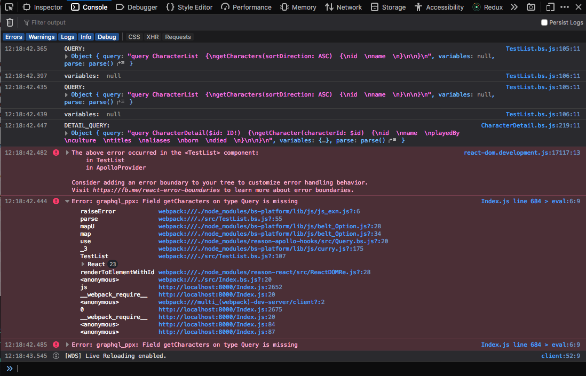

# demo

## Run Project

```sh
yarn install
yarn start
# in another tab
yarn run webpack
# in another tab
yarn run server
```

Open <http://localhost:8000>

The following query works in `Graphiql` and `curl` and can be see here:

```bash
curl 'https://j96vt.sse.codesandbox.io/' -H 'Accept-Encoding: gzip, deflate, br' -H 'Content-Type: application/json' -H 'Accept: application/json' -H 'Connection: keep-alive' -H 'DNT: 1' -H 'Origin: https://j96vt.sse.codesandbox.io' --data-binary '{"query":"# Write your query or mutation here\nquery CharacterList {\n  getCharacters(sortDirection: ASC) {\n    id\n    name\n    playedBy\n    culture\n    allegiances {\n      name\n    }\n    isAlive\n  }\n}"}' --compressed
```

Or open <https://j96vt.sse.codesandbox.io/> and add this query

```graphql
query CharacterList {
  getCharacters(sortDirection: ASC) {
    id
    name
    playedBy
    culture
    allegiances {
      name
    }
    isAlive
  }
}
```

When you run this project, you get the following error in the browser console.

`Error: graphql_ppx: Field getCharacters on type Query is missing Index.js line 684 > eval:6:9`



You can see the live errors by opening <https://graphql-ppx-error.idkjs.now.sh/> the opening the dev tools console.
The field is obviously there. Maybe I am missing something?
